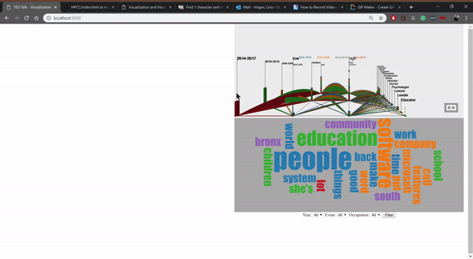
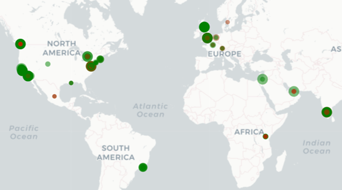
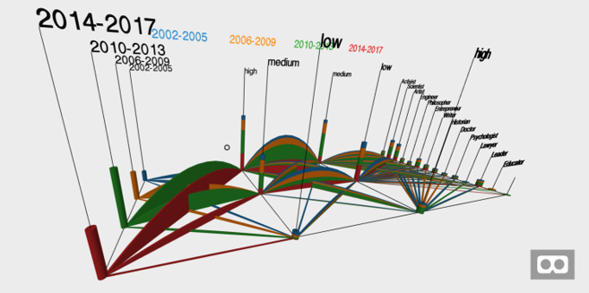
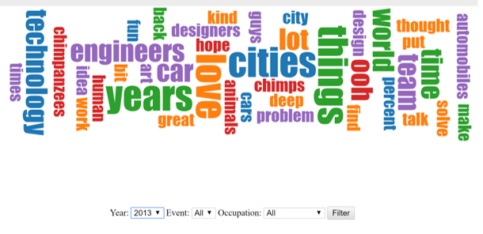
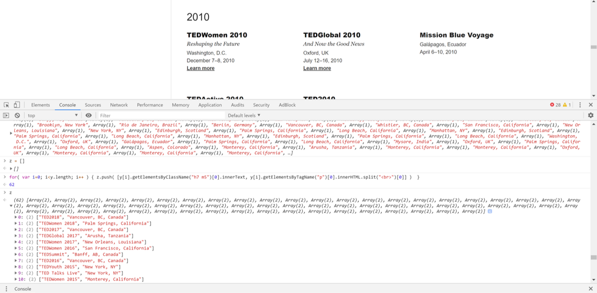

# CS5331-DataVisualization Text Geospatial Network Visualization
Text-Geospatial-Network visualization on TED Talks data.

[View Demo](https://lvrg12.github.io/TEDTalk-Viz/)
Video Demo (data/TEDTalkVizViddemo.mp4)

## Description
This web application shows a visulization of 1500 TED Talks given from 2002 to 2017. It consists of a geospatial map, parallel coordinates, a word cloud, and a filter mechanism. TEDTalk-Viz is inteded to show the geographical distribution of TED talks. It also shows the popularity and controversy of each talk based on the number of views and comments. Using a topic model word cloud, the app is able to show the main topics and terms for the selected talks. Finally, using both the selection and parallel coordinates, the web app can show the distribution of speaker occupations.

## Dataset
The dataset utilized was gotten from Kaggle. It containes the talk title, # of speaker, speaker name, speaker occupation, event, location, comments, and views. There is a second dataset that contains the transcript for each talk. Both of them are saved in csv files. There was a lot of preprocessing done, some of which got the latitude and longitude of the locaton, and separating the year from the event.

## Features
The four sections of this web applications are the map, parallel coordinates, word cloud, and filter mechanism.

### Geospatial Map
A word map is displayed in left side of the screen. It has dots scattered around the globe which represent each talk in the dataset. Furthermore, the dots encode several TED talks attributes. Firstly, the x and y coordinates represent the actual location (latitude, longitude) of the event where the talks took place. The color of the dot represent the popularity of the amount of views the talk got. The color is based on an interpolation of a bicolor scale, green to red. The green represents high number of views (higher than 1,000,000) whereas red represents low views (fewer than 150,000). The radius of dots represent the amount of controversy the talk got, based on the number of comments. The range goes from low (lower than 100 comments) to high (higher than 500 comments). Finally, when the user hovers the cursor over each dot, a tooltip with information regarding the talk appears on top of the dot.

### 3D Parallel Coordinates
The 3D parallel coordinates is located in the top right corner of the screen. It uses a categorical version of the TED dataset. It shows 4 attributes: year, views, comments, and speaker occupation. The user is able to navigate through the graph by the WASD keys and using the mouse to change the angle vision. The chart can also be displayed in full screen and potentially in VR by clicking on the VR button. The information describes trends and patternes mostly depending on how the attributes are arranged. By having the views next to the year, it can be observed that the most recent talks have gathered higher number of views.

### Topic Modelling Word Cloud
The word cloud visualization implements an LDA algorithm to find the topics and terms of a given set of talks. For instance, if the user selects all the talks whose speaker was an educator, the LDA algorithm would run and then draw the word cloud based on the results. Since the algorithm is computed in the client side, a worker is utilized to allow the web application to keep working while the algorithm is being computed. The word cloud have terms that are color coded by the topic the belong. And the word font size determines the likelihood of the term to termine the topic.

### Filter
The filter mechanism is located in the bottom right corner and it allows the user to filter the dataset by the given options. The user can filter by year, event, speaker occupation, or a combination of the 3. Once the user clicks the filter button both the map and the word cloud will update. The map will only show the non-filtered talks and the word cloud will run LDA on the non-filtered talks.

## Discoveries

It can be seen in the map that most talks take place in high population areas.

The parallel coordinates shows an interesting pattern between the talk's views and the talk's comments. The higher the number of views the lower the number of comments and vice versa. One potential explanation of this is because people like and agree with certain talks so more people watch them. In the other hand, when people find a talk dislikable or controversial less people watch it but still comment.

Moreover, the following word cloud shows the topic modelling of all talks that happened in 2013. Each topic is pretty much clearly defined by its terms. For instance the most prominent topic is perhaps the green one, which is probably comming from leaders and activists. The orange topic is comming from psychologists or philosophers. Another prominent one is the purple topic. It shows terms related to engineering and science.

## Challenges
The dataset require a lot of preprocessing since many of the require attributes were not in the desire format. Firstly, the location attribute was not on the original dataset, so we had to web scrappe the TED website to get the city, country location of each event.

Afterwards, a python script was used to convert the location in city, country form to the actual latitude and longitude. Excel was used extensively to categorize the views and comments to "low", "medium", and "high" for the parallel coordinates. It was also used to separate the year from the event attribute. The transcript dataset was formated as there were many instances of double quotations marks that hindered reading the data. Finally, the speaker occupations were largely classified manually as neither the parallel coordainates or the filtering selection box would look adequate with many values.

The map functionalities had to be debugged as the zooming and image positioning were not compatible with the layout. The parallel coordinates code had to also be slightly edited to be embedded into an html page. The word cloud still takes quite a lot of time to render. This is due to the LDA computation. Finally, the selection was built last so there are still non implemented functionalities.

## Development
The development of TEDTalk-Viz was organized as followed:

Alexander
- Map functionalities
- Dots coloring
- Dots size
- Dots tooltip

Andrew
- Web app layout
- CSS styling
- Filtering
  - Updating map view on filter
  - Updating word cloud on filter

Lino
- Dataset preprocess
- Parallel Coordinates
- LDA library implementation
- Word cloud implmentation
- GitHub Report

## References
- https://github.com/primaryobjects/lda (LDA)
- https://bl.ocks.org/jyucsiro/767539a876836e920e38bc80d2031ba7 (Word cloud)
- https://www.kaggle.com/rounakbanik/ted-talks (Dataset)
- http://bl.ocks.org/jhubley/25f32b1f123dca4012f1 (Map)
- https://github.com/iDataVisualizationLab/VRParallelSet (Parallel Coordinates)
